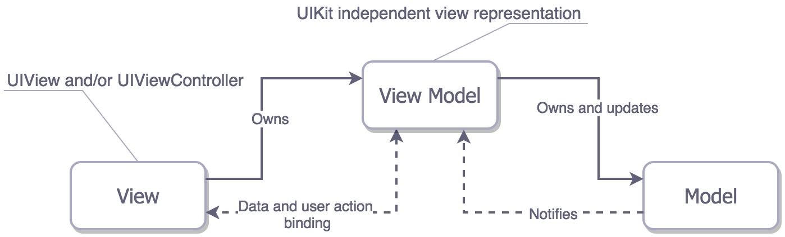

# Architecture
## MVVM pattern

- Purpose: Solve the Massive UIViewController
- description of Architecture such as pattern ... 

## UI
- Use Autolayout in Storyboard, xib
- Set as high as possible in storyboard, xib 
- ViewController and Stroryboard is 1:1 mapping for resolve conflict


## Library
- Take a look at `Podfile`

# Basic Rule
## Default
- Coding Conventions: https://github.com/raywenderlich/swift-style-guide


## Git CommitMessage Format
- Template
```
[`${ProjectName}`-`${IssueNumber}`]<`${Type}`> `${title}`
BLANK
- `${BODY}`
```

- Sample
```
[RxStudy-0001]<FEAT> Add AssetTop

[RxStudy-0002]<FIX> fixed race condition when refresh to assetTop

[RxStudy-0002]<REFACTOR>

[NO-BTS]<CHORE>versionUp 1.0.3.1
```

## Folder
- RxStudy
  - Core
  - Features
    - ${Feature}ViewController / ViewModel / View / CellModel / Cell
    
  
  
